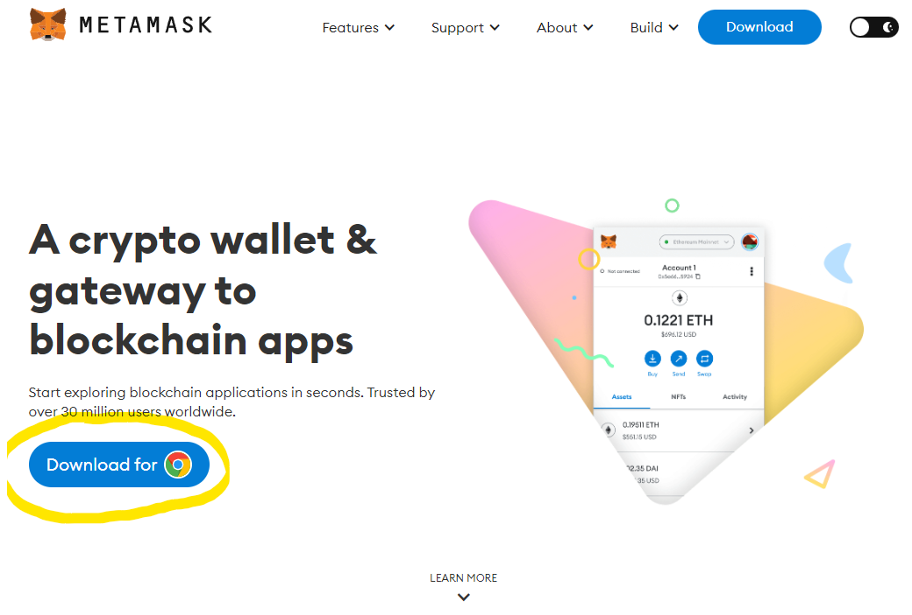

= First steps

== Get a Metamask wallet

=== Why MetaMask?

MetaMask is a crypto wallet, which is used to interact with the Ethereum Blockchain.
With MetaMask users can easily access their Ethereum wallet through a browser extension or a mobile app. Those can be used to interact with decentralized apps.

=== MetaMask Setup

First you need to head to the MetaMask website: https://metamask.io/.
Now you need to click on the "Install MetaMask for Chrome" button, which is shown in the following picture:

This will take you to the Chrome Web Store. There you need to click the "Add to Chrome" button. This is completely free.
Supported browsers are: Chrome, Firefox, Brave, Edge and Opera.
Once MetaMask is installed, you will see the MetaMask fox in the top right corner of your browser.
When you click on the fox icon, you are given the option to "Get started". Once you clicked on this, you will see the following screen:

Now you have to click on the "Create a Wallet" button. The system will ask you if you want to share analytics data with Metamask, which is up to you to decide.
Once you decided on this, you are asked to create a password. This password will allow you to access your wallet, therefore you should use a strong password.
On the next page you will be given a set of 12 words that act as your private key. This key gives you access to all your digital assets. If you forgot your password, you can use these 12 words to gain access again.
So please write those words down (in the correct order!) for the case of forgetting your password.
Also, please don´t share those phrases because everyone that knows them can access your assets.
Only once you have written the phrases down, click "Next". Then MetaMask will ask you to confirm your secret recovery phrase by selecting the words in the order they were displayed before.
Once you have done that, you can click "Continue". With this you successfully created your Metamask wallet, which you can always access via the browser extension in your browser.
