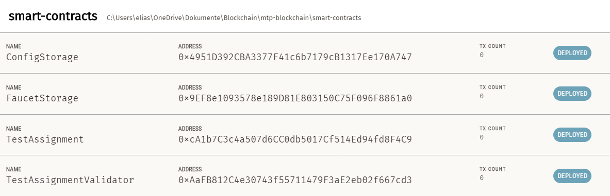

# Faucet API
## Local Setup

Follow the steps to use the system locally.

### Prerequisites

1. Change directory to `faucet`.
2. Install packages using npm `npm i`

### 1. Ganache configuration

To use the web3 applications locally, the [Ganache](https://trufflesuite.com/ganache/) application is required. 

- IP: `http://localhost:8545`
- Chain Id: `1337`
- MNEMONIC: `exclude curve virtual science volume siren nose crop bike again buffalo trick`

#### Ganache - Server config


#### Ganache - Accounts & Key config


To properly view the deployed smart-contracts link the `truffle-config.js` to Ganache.

#### Ganache - Truffle Config JS config


### 2. Deploy smart contracts to local chain

To properly use the API the corresponding smart contracts have to be deployed to the local chain. 

The docu how to deploy the smart contracts to the chain can be viewed in the [Readme](../smart-contracts/README.md)  from the `smart-contracts` module. 

### 2. Deploy smart contracts to local chain

Deploy contracts to chain using truffle.

1. Compile contracts `truffle compile`
2. Deploy contracts `truffle deploy`

### 3. View Contracts in Ganache

Ganache allows to view the deployed smart contracts. Make sure the blue box on the right says "DEPLOYED".



### 4. Find deployed contract addresses

The API requires that the faucet contract address is defined via env variable. The get the contract address navigate to the "Smart Contract View" (see step #3) and open the `FaucetStorage` contract. Copy the "ADDRESS" and paste it into the `.env` file ([this one](./config/dev/.env)).

Define also the `UNLOCKED_ACCOUNT` in the `.env` file. This address has to be unlocked and enough ether to execute the sendEth function.

### 5. Send eth to faucet contract

The faucet contract needs to have some ether to send to the students. To do so, send some ether to the faucet contract address. Use metamask or any other option to send gas to the FaucetStorage contract address.

### 6. Start express api

To start the express api use the following command:

```bash
npm run dev
```

## API Usage

The API has one endpoint that can be used to send ether to a student. The endpoint is `POST /sendEth` and requires the following body:

```json
{
    "toAddress": "0x9f8fD6722f8f74c9942d0751374a542F5847BfD1"
}
```