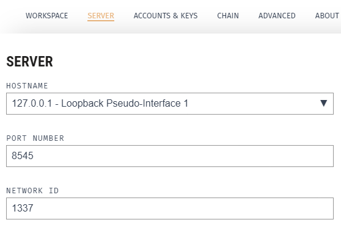
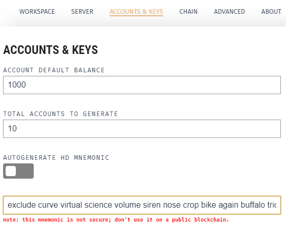

# Frontend
[](https://github.com/Jonas-Grill/mtp-blockchain/actions/workflows/test-web3.yml)

## TODO:
- [ ] Naming convention besser durchziehen manchmal camelcase manchmal mit underscore ... bad style

## Local Setup

Follow the steps to use the system locally.

### Prerequisites

1. Change directory to `frontend`.
2. Install packages using npm `npm i`

### 1. Ganache configuration

To use the web3 applications locally, the [Ganache](https://trufflesuite.com/ganache/) application is required. 

- IP: `http://localhost:8545`
- Chain Id: `1337`
- MNEMONIC: `exclude curve virtual science volume siren nose crop bike again buffalo trick`

#### Ganache - Server config


#### Ganache - Accounts & Key config


To properly view the deployed smart-contracts link the `truffle-config.js` to Ganache.

#### Ganache - Truffle Config JS config


### 2. Deploy smart contracts to local chain

To properly use the API the corresponding smart contracts have to be deployed to the local chain. 

The docu how to deploy the smart contracts to the chain can be viewed in the [Readme](../smart-contracts/README.md)  from the `smart-contracts` module. 

### 3. Deploy smart contracts 
To use the frontend run: 

```
npm run dev
```

### 4. Usage
The frontend is accessible over the `3000` Port on `localhost`.