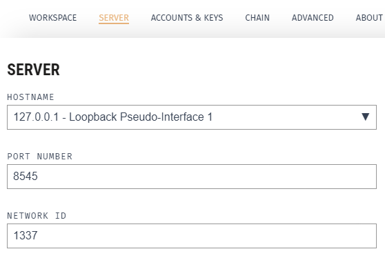
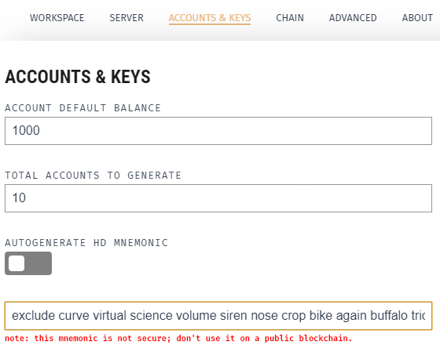
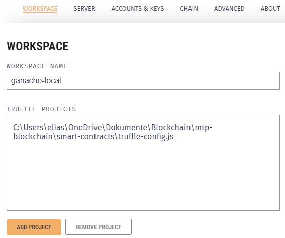
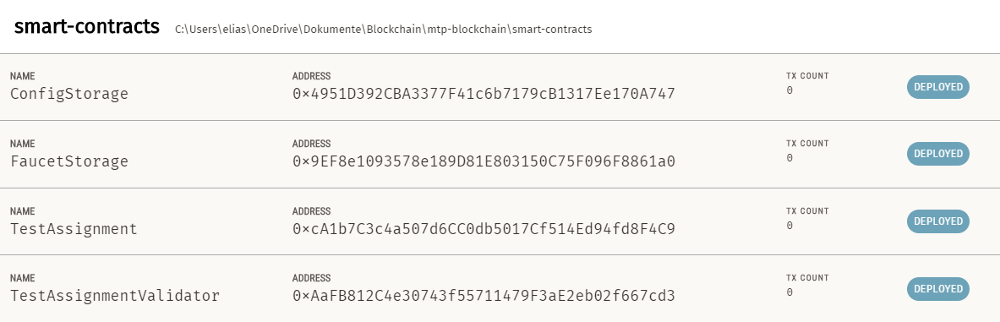

# Smart-contracts
[](https://github.com/Jonas-Grill/mtp-blockchain/actions/workflows/test-truffle.yml)

## Local Setup

Follow the steps to use the system locally.

### Prerequisites

1. Change directory to `smart-contracts`.
2. Install packages using npm `npm i`

### 1. Ganache configuration

To use the web3 applications locally, the [Ganache](https://trufflesuite.com/ganache/) application is required. 

- IP: `http://localhost:8545`
- Chain Id: `1337`
- MNEMONIC: `exclude curve virtual science volume siren nose crop bike again buffalo trick`

#### Ganache - Server config


#### Ganache - Accounts & Key config


To properly view the deployed smart-contracts link the `truffle-config.js` to Ganache.

#### Ganache - Truffle Config JS config


### 2. Deploy smart contracts to local chain

To properly use the API the corresponding smart contracts have to be deployed to the local chain. 

The docu how to deploy the smart contracts to the chain can be viewed in the [Readme](../smart-contracts/README.md)  from the `smart-contracts` module. 

### 2. Deploy smart contracts to local chain

Deploy contracts to chain using truffle.

1. Compile contracts `truffle compile`
2. Deploy contracts `truffle deploy`

### 3. View Contracts in Ganache

Ganache allows to view the deployed smart contracts. Make sure the blue box on the right says "DEPLOYED".




## Smart Contract Usage

In total the project has two major smart contracts:
1. `ConfigStorage`
    - Stores all necessary config parameters for the system to properly operate
2. `FaucetStorage`
    - Functions that are necessary for operating the ethereum faucet

Further the project also has some smart contracts that are implicitly deployed on the chain via inheritance. 

Three contract are used for this:
1. `BaseAdmin`
    - Admin related functions
2. `BaseAssignment`
    - Base functions that every assignment contract (from the students) needs
3. `BaseAssignmentValidator`
    - Base functions that every assignment validator contract (from the instructor) needs


### Base Contract usage

A base contract can be easily imported into any other smart contract by importing the `.sol` file and referencing the file. 

Example:
```
import "../contracts/BaseAdmin.sol";

contract ConfigStorage is BaseAdmin {
    ...
}
```

> In this example the `ConfigStorage` smart contract inherits any function the `BaseAdmin` class owns.

### Development of custom assignment validators

To develop custom assignment validators two parts a necessary.

#### Part 1 - Assignment interface

First of all the instructor needs to write a smart contract which own all the necessary functions to test the smart contract as `virtual` functions. This file can than be inherit by the student and by the validator contract. 

An example interface file can be viewed here [`TestAssignmentInterface.sol`](/smart-contracts/contracts/TestAssignmentInterface.sol). As you may see, each function has no content and uses the `virtual` keyword. Therefore, the students do not get help to solve the asignment but get a sceleton to implement the necessary functions/methods.

#### Part 2 - Assignment Validator contract

Secondly, the instructor needs to create the necessary validation contract. To ensure that each validation contract follow the same guidelines as the other the validation smart contract needs to inherit the `BaseAssignmentValidator` contract. This base contract, offers an interface every assignment validator contract needs.

An example usage of the smart contract can be seen in the [`TestAssignmentValidator.sol`](/smart-contracts/contracts/TestAssignmentValidator.sol) file.

#### Example

The `TestAssignment` Contract is a mock assignment with some simple functions. This contract is the result the student deploys to the blockchain. 

The instructor needs to develop a interface contract which is in our case the `TestAssignmentInterface`. As you may see, the functions are not implemented and marked as `virtual`. But, they allow the `TestAssignmentValidator` contract to call the necessary functions for every contract which inherits the `TestAssignmentInterface`.

Using the frontend it is possible to test the deployed `TestAssignment` by taking the address of the person who deployed the `TestAssignment` (should be the student address) and the address of the `TestAssignment` smart contract. Using these two parameters and the address of the validation contract it is possible to test any implemenation of the `TestAssignment` contract (as long as the functions are implemented). 
